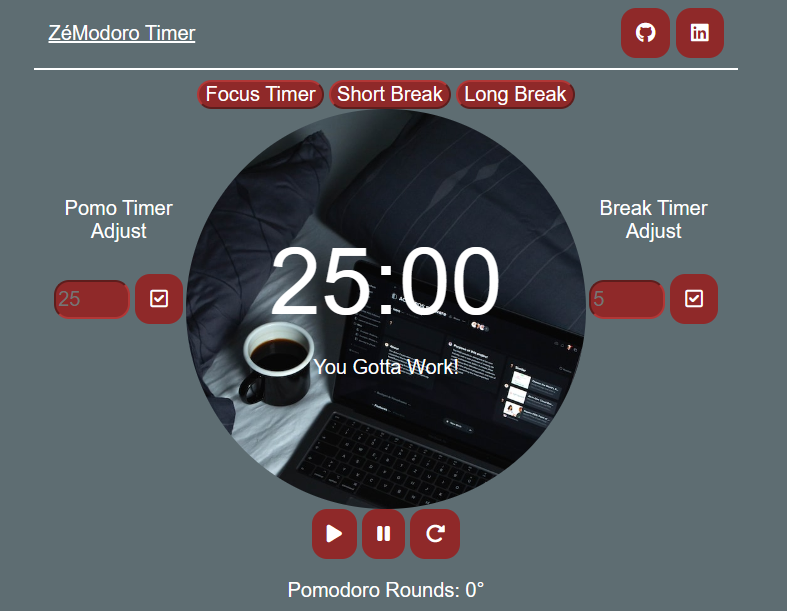
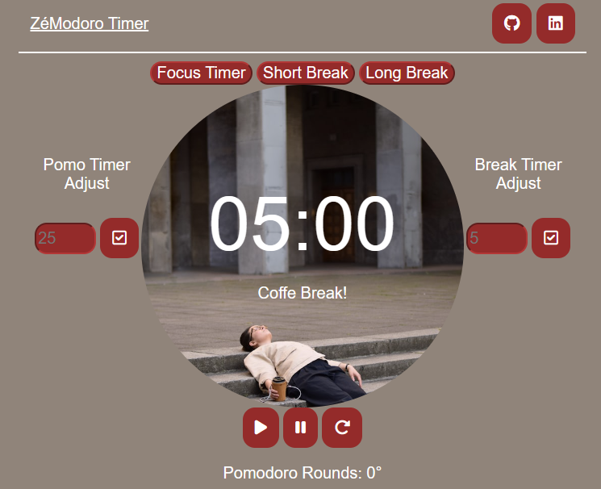

# ZeModoro
<h1>Objective</h1>

 The main purpose of this project is just to learn and practice a little bit more about web tecnologies, so feel confortable to suggest some features, improvements in this code/page layout or use it as a base for your codes👨🏻‍💻 

<h1>About</h1>

The Pomodoro is a technique for studying (or just concentrate/focus) on a task. The idea is to divide some large windows to focus and intercalate them with small windows to relax and, after 3 cycles of windows, take a large relax window.

Since this a simple project (just to train some fundamentals) i'm just using base technologies as HTML, CSS and JS (without any major framework).

<h1>How it works</h1>

The pomodoro has three states (Work Time, Small Break and Long Break) and all the logic and layout work around this idea. So we have different layouts for each state and we can set the state we want to be.

<h1>Work Time</h1>

<h1>Small Break</h1>

<h1>Long Break</h1>

